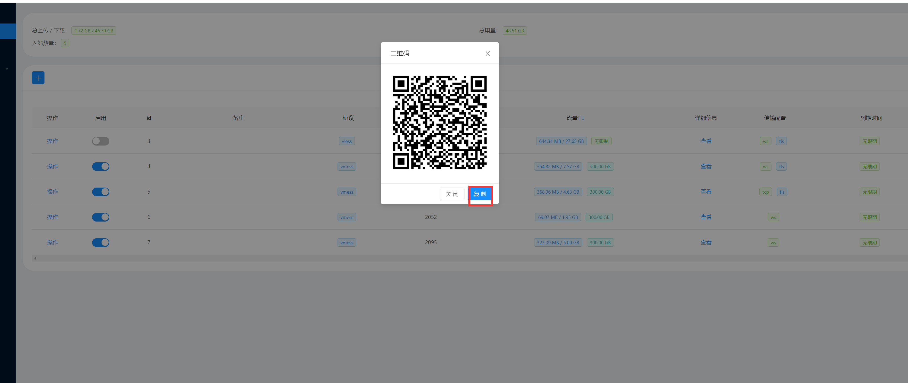
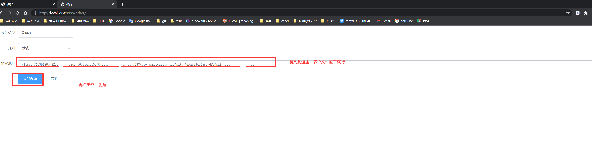
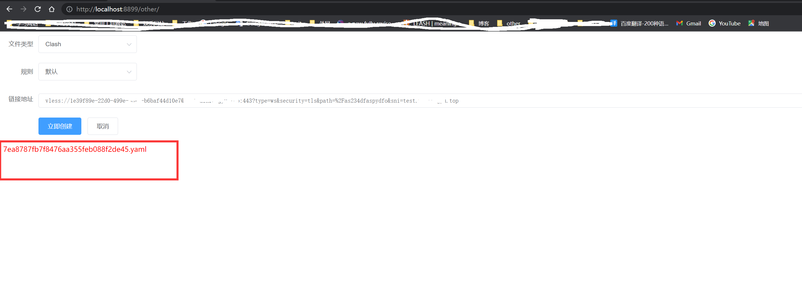
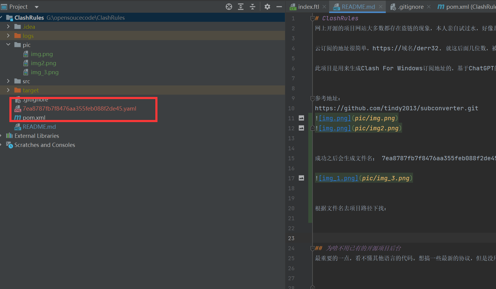

# ClashRules
网上开源的项目网站大多数都存在盗链的现象，本人亲自试过水，好像是一生成云订阅地址就会导致连接被盗用，并不是说开源网站的锅，据本人观察是有人恶意使用爆破攻击订阅地址的url。

云订阅的地址很简单，https://域名/derr32. 就这后面几位数，被别人使用爆破，很容易就被试出来，故此，重复造轮子，新建了此项目。 欢迎大佬贡献其他协议代码。 

此项目是用来生成Clash For Windows订阅地址的，基于ChatGPT的建造，耗时总3小时左右。由于本人平时只使用Vmess协议，单一性很强。

参考地址：
https://github.com/tindy2013/subconverter.git

成功之后会生成文件名； 7ea8787fb7f8476aa355feb088f2de45.yaml

根据文件名去项目路径下找： 

这个文件即时Clash配置文件，可以直接使用
## 为啥不用已有的开源项目后台
最重要的一点，看不懂其他语言的代码。想搞一些最新的协议，但是没用嗨呀！

